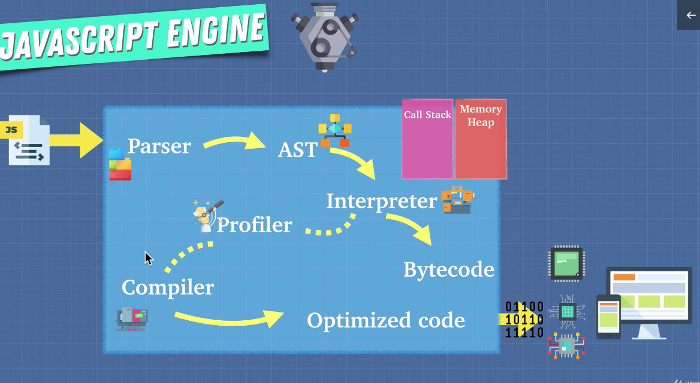
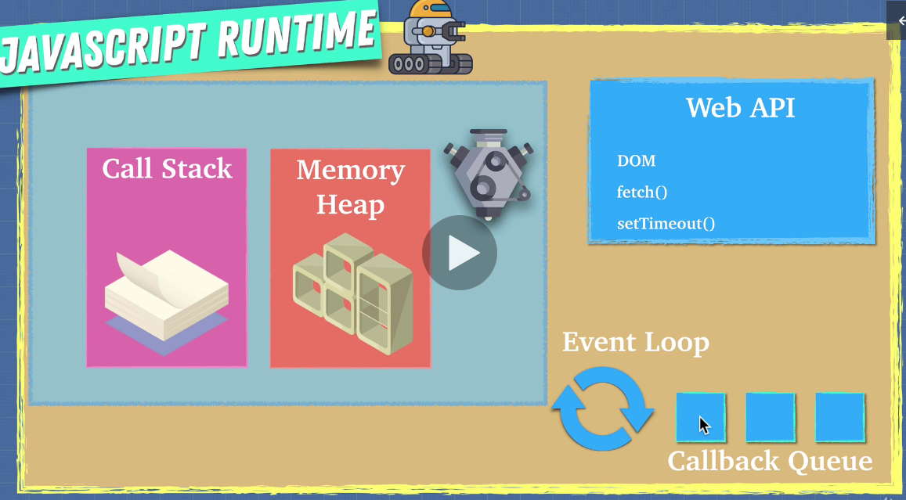
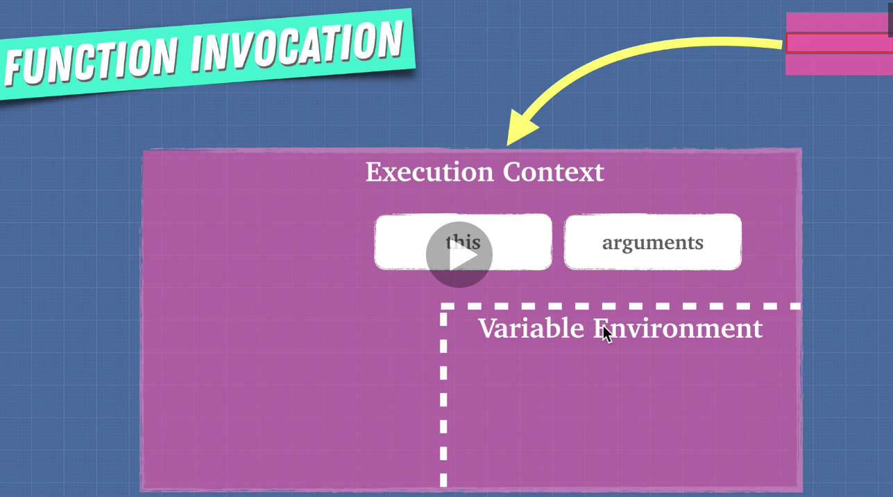
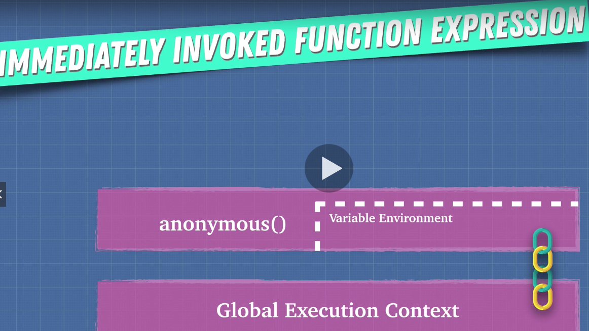
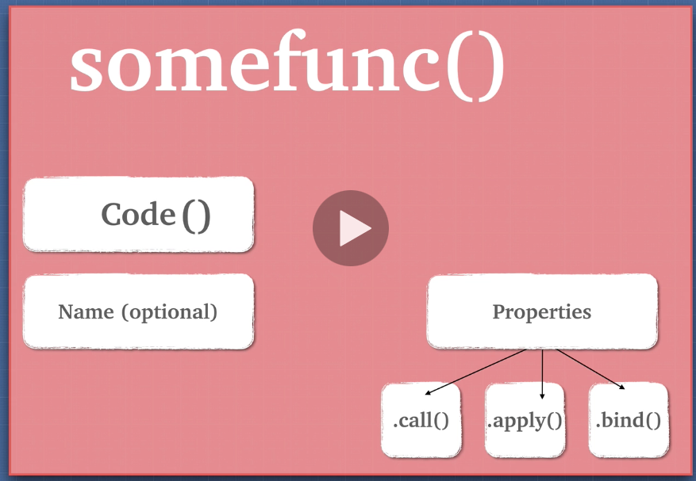
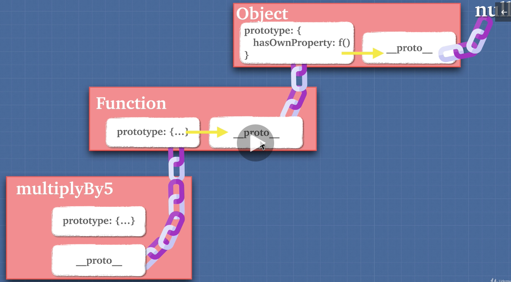

## Javascript Engine



**_Memory Heap_**: where the memory allocation happens

**_Call Stack_**: where the engine keeps track of where your code is and it's execution

```javascript
// Heap
const number = 10; // allocate memory for number
const string = ""; // allocate memory for a string
const human = { firstname: "", lastname: "" }; // allocate memory for an object and its values

// Call Stack
// allocate heap memory for this function
function calculate() {
  const total = 4 + 5;
  return total;
}
calculate(); // add function onto call stack
```

Memory Leak

```javascript
let array = [];
for (let i = 5; i > 1; i++) { // the loop never ends
  array.push(i - 1);
}

// 容易造成 memory leak 的几点
// global variable in global scope
var a = 1;
var b = 1;

// event listeners
var element = document.getElementById("button");
element.addEventListener("click", onClick); // keep adding but never removed

// setInterval
setInterval(() => {
  // referencing objects... will never be collected by GC until setInterval() gets cancelled
});
```

---



```javascript
console.log("1");
setTimeout(() => {
  console.log("2");
}, 0); // js engine send this to Web API
console.log("3");
// 1, 3, 2

//fill an array with 60000 elements
const list = new Array(60000).join("1.1").split("."); // 1.11.1 -> [1, 11, 1]
function removeItemsFromList() {
  var item = list.pop();

  if (item) {
    // removeItemsFromList(); // stackoverflow - too much recursive call
    setTimeout(removeItemsFromList, 0); // correct!
  }
}
removeItemsFromList();

setTimeout(() => {
  console.log("1");
}, 0);
Promise.resolve().then(() => console.log("2"));
console.log("3");
// 3, 2, 1
```

---

```javascript
// function expression
var canada = () => {
  console.log("cold");
};
// function declaration, will hoist
function india() {
  console.log("warm");
}
```



```javascript
const/var x = "x";
function sayMyName() {
  var a = "a";
  console.log(x); // x
  return findName();
}
function findName() {
  var b = "b";
  console.log(x); // x
  return printName();
}
function printName() {
  var c = "c";
  console.log(x); // x
  return "Ziyi";
}

function sayMyName() {
  var a = "a";
  return function findName() {
    const/var b = "b";
    return function printName() {
      var c = "c";
      console.log(b); // b
      return "Ziyi";
    };
  };
}
sayMyName()()();
```

### Function scope VS Block scope

JS only create scope when there is a function

```javascript
// secret is in global scope
if (5 > 4) {
    var secret = '12345';
}
secret // 12345

// secret is in a function scope
function a(5 > 4) {
    var secret = '12345';
}
secret // not defined
```

#### let / const are block scope

```javascript
function loop() {
  for (let i = 5; i < 5; i++) {
    // i lives only in the for loop
    console.log(i);
  }
  console.log(i); // i is not undefined
}
```

### IIFE



```javascript
// function expression
(function () {
  var a = 1;
})();
a; // a is not undefined

var script1 = (function () {
  function a() {
    return 5;
  }
  return {
    a: a,
  };
})();
script1.a(); // 5
```

### This key word

1. Gives methods access to their object
2. Execute same code for multiple objects

```javascript
const obj = {
  name: "Billy",
  sing() {
    return "lalala" + this.name;
  },
  singAgain() {
    return this.sing() + "!";
  },
};

function importantPerson() {
  console.log(this.name);
}
const name = "Sunny";
const obj1 = {
  name: "Cassy",
  importantPerson: importantPerson,
};
const obj2 = {
  name: "Jacob",
  importantPerson: importantPerson,
};
importantPerson(); // sunny
```

**_In JS，lexical scope(available data + variables where the function was defined) determines our available variables. Not where the function is called (dynamic scope)._**

```javascript
const obj = {
  name: "Billy",
  sing() {
    console.log("a", this);
    var anotherFunc = function () {
      console.log("b", this);
    };
    anotherFunc();
  },
};
obj.sing();
// a {name: "Billy", sing: ƒ}
// b Window {parent: Window, opener: null, top: Window, length: 0, frames: Window, …}

// 1st option, arrow function
// using arrow function, the `this` is lexically scoped, it does not care where the function is called.
const obj = {
  name: "Billy",
  sing: function () {
    console.log("a", this);
    var anotherFunc = () => {
      console.log("b", this);
    };
    anotherFunc();
  },
};
obj.sing();
// a {name: "Billy", sing: ƒ}
// b {name: "Billy", sing: ƒ}

// 2nd option, call
const obj = {
  name: "Billy",
  sing: function () {
    console.log("a", this);
    var anotherFunc = function () {
      console.log("b", this);
    };
    anotherFunc.call(this);
  },
};
obj.sing();
// a {name: "Billy", sing: ƒ}
// b {name: "Billy", sing: ƒ}

// 3rd option, self
const obj = {
  name: "Billy",
  sing: function () {
    console.log("a", this);
    var self = this;
    var anotherFunc = function () {
      console.log("b", self);
    };
    anotherFunc();
  },
};
obj.sing();
// a {name: "Billy", sing: ƒ}
// b {name: "Billy", sing: ƒ}
```

### Context vs Scope

Context: How a function is invoked with the value of `this` keyword.

Scope: Refers to the `visibility of variables`.

---



Functions are first class citizens in JS

1. Assign function to variable

```javascript
var stuff = function () {};
```

2. Pass function as parameter

```javascript
function a(fn) {
  fn();
}
a(() => {
  console.log("Hi");
});
```

3. Return a function as a value from another function

```javascript
function b() {
  return function c() {
    console.log("Hi");
  };
}
b()(); // Hi
```

### High Order Function

```javascript
const multiplyBy = (num1) => (num2) => num1 * num2;
const multiplyByTwo = multiplyBy(2);
multiplyByTwo(6);
```

---

### Closure

```javascript
function a() {
  let grandpa = "grandpa";
  return function b() {
    let father = "father";
    return function c() {
      let son = "son";
      return `${grandpa} > ${father} > ${son}`;
    };
  };
}
a()()(); // "grandpa > father > son"
```

```javascript
function callMeMaybe() {
  setTimeout(() => console.log(callMe), 2000); // closure
  const callMe = "Hi!"; // NOT hoisting, callMe is in lexical scope of the function, it will be referenced in closure.
}
callMeMaybe(); // Hi!
```

```javascript
function callMeMaybe() {
  setTimeout(console.log(callMe), 2000);
  const callMe = "Hi!";
}
callMeMaybe(); // Cannot access 'callMe' before initialization
```

```javascript
const array = [1, 2, 3, 4];
for (var i = 0; i < array.length; i++) {
  setTimeout(() => console.log("I am at index " + i), 1000);
}
// I am at index 4

// 正确 1
const array = [1, 2, 3, 4];
for (let i = 0; i < array.length; i++) {
  // let
  setTimeout(() => console.log("I am at index " + i), 1000);
}
// I am at index 0
// I am at index 1
// I am at index 2
// I am at index 3

// 正确 2
const array = [1, 2, 3, 4];
for (var i = 0; i < array.length; i++) {
  (function (i) {
    // 不能忘 i
    setTimeout(() => console.log("I am at index " + i), 1000);
  })(i); // 不能忘 i
}
// I am at index 0
// I am at index 1
// I am at index 2
// I am at index 3
```

---

### Prototypal Inheritance

```javascript
multiplyBy5() {}

multiplyBy5.__proto__  // ƒ () { [native code] } -- prototype of base function object
Function.prototype     // ƒ () { [native code] }

const obj = {}
obj.__proto__ // {constructor: ƒ, __defineGetter__: ƒ, __defineSetter__: ƒ, hasOwnProperty: ƒ, __lookupGetter__: ƒ, …}
Object.prototype // {constructor: ƒ, __defineGetter__: ƒ, __defineSetter__: ƒ, hasOwnProperty: ƒ, __lookupGetter__: ƒ, …}
Object.prototype.__proto__ // null

const array = [];
array.__proto__
Array.prototype
是相等的
```



```javascript
let dragon = {
  name: "Tanya",
  fire: true,
  fight() {
    return 5;
  },
  sing() {
    if (this.fire) {
      return `I'm ${this.name}`;
    }
  },
};

let lizard = {
  name: "kiki",
  fight() {
    return 1;
  },
};

lizard.__proto__ = dragon;
lizard.sing(); // works
dragon.isPrototypeOf(lizard); // true

for (let prop in lizard) {
  console.log(prop);
}
// name  fight  fire  sing
for (let prop in lizard) {
  if (lizard.hasOwnProperty(prop)) {
    console.log(prop);
  }
}
// name  fight - lizard itself only has name and fight
```
