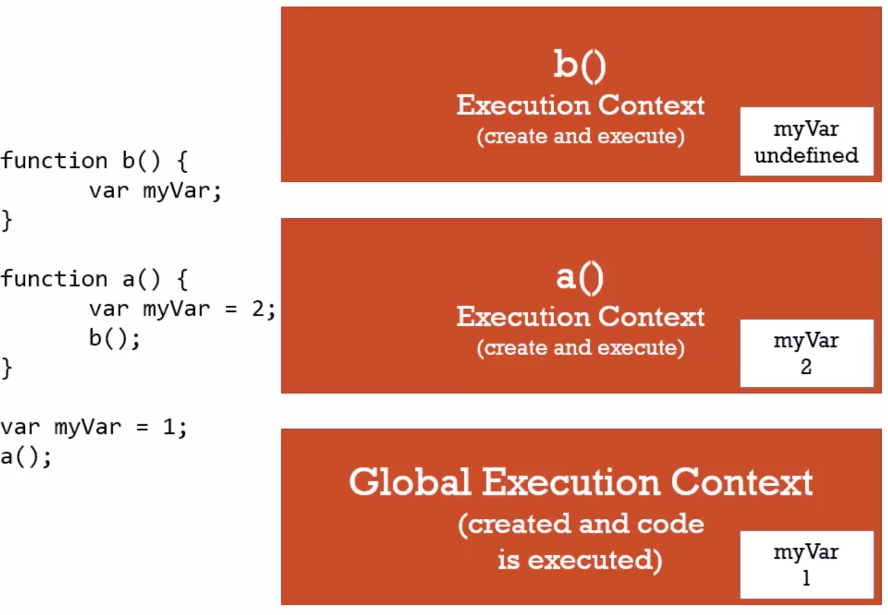
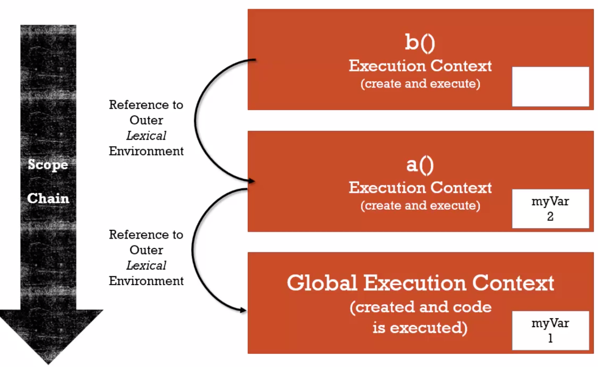

**_Syntax Parser_** : A program that reads your code and determines what it does and if its grammer is valid.

**_Lexical Environment_** : Where something sits physically in the code you write. A lexical environment exists in programming languages in which **where** you write something is **important**.

**_Execution Context_** : A wrapper to help manage the code that is running.

---

### Hoisting

**_Execution Context Creation Phase_**

Allocate memory for variables and functions during creation phase.


**_Execution Context Execution Phase_**


```javascript
b();
console.log(a);

var a = "Hello World"; // variable declared by let or const will NOT hoist
function b() {
  console.log("Called b!");
}
// Called b!
// undefined

b();
// function b will not be hoisted
(function b() {
  console.log("Called b!");
});
// b is not defined

b();
// b will not be hoisted
var b = function () {
  console.log("Called b!");
};
// b is not defined

var favoriteFood = "grapes";
const foodThought = function () {
  console.log("Original favorite food: " + favoriteFood);
  var favoriteFood = "sushi"; // hoist happens
  console.log("New favorite food: " + favoriteFood);
};
foodThought();
// Original favorite food: undefined
// New favorite food: sushi

var favoriteFood = "grapes";
const foodThought = function () {
  console.log("Original favorite food: " + favoriteFood);
  const favoriteFood = "sushi";
  console.log("New favorite food: " + favoriteFood);
};
foodThought();
// Cannot access 'favoriteFood' before initialization

var favoriteFood = "grapes";
const foodThought = function () {
  console.log("Original favorite food: " + favoriteFood);
  favoriteFood = "sushi";
  console.log("New favorite food: " + favoriteFood);
};
foodThought();
// Original favorite food: grapes
// New favorite food: sushi
```

---

**_Single Threaded_** : one command at a time. One call stack and one memory heap.

**_Synchronous_** : one at a time and in order.

**_Variable Environment_**



---

### Scope

**_Scope_** : **Where a variable is available in your code** and if it is truly the same variable or a new copy.

### The Scope Chain

- **Function b is lexically in Global context, although it is called in function a**

```javascript
function b() {
  console.log(myVar); // 1
}

function a() {
  var myVar = 2;
  b();
}

var myVar = 1;
a();
```


- **Function b is lexically in function a**

```javascript
function a() {
  function b() {
    console.log(myVar); // 2
  }
  var myVar = 2;
  b();
}

var myVar = 1;
a();
```



---

**_Main Thread and Web API event_**

```javascript
function waitThreeSeconds() {
  var ms = 3000 + new Date().getTime();
  while (new Date() < ms) {}
  console.log("finished waitThreeSeconds");
}

function clickHandler() {
  console.log("click event!");
}

document.addEventListener("click", clickHandler);

waitThreeSeconds();
console.log("finished execution");

// finished waitThreeSeconds
// finished execution
// click event! -- even if you click during the wait
```

---

**_Primitive Type_** : A type of data that represents a signle value, not an object.

Primitive:

- undefined: represents lack of existence, should not set a variable to this by developer.
- null: represents lack of existence, can set a variable to this by developer.
- boolean
- number
- string
- symbol

Non-primitive

- object: array and function are object

**_Coercion_** :

```javascript
Number(undefined); // NaN
Number(null); // 0

false == 0; // true
null == 0; // false
null < 1; // true
"" == 0; // true
"" == false; // true
Boolean(undefined); // false
Boolean(null); // false
Boolean(""); // false

"" || "hello"; // hello

false == ""; // true
false == []; // true
false == {}; // false
"" == 0; // true
"" == []; // true
"" == {}; // false
0 == []; // true
0 == {}; // false
0 == null; // false
```

---

### Object

```javascript
var person = new Object();
person["firstname"] = "Tony";

person.address = new Object();
person.address.street = "street";
```

### Object Literal

```javascript
var person = {
  firstname: "Tony",
  lastname: "Alice",
  address: {
    street: "street",
  },
};
```

#### JSON vs Javascript Literal

JSON is more strict and requires quotes around the object's key.

**_First Class Functions_** : everything you can do with other types, you can do with functions. Assign them to variables, pass them around and create them on the fly.

```javascript
// Add a property to the greet function
function greet() {
  console.log("Hi");
}
greet.language = "english";
console.log(greet.language);
```

### Function Expression and Statement

**_Expression_** : A unit of code that results in a value. It does not have to save to a variable.

```javascript
// expression
var a = 3;
1 + 2;
a = { greeting: "Hi" };

// create a function object and assign it to a variable
var anonymousGreet = function () {
  console.log("Hi");
};
// this execution only works after the expression, if called before, it will say `undefined is not a function`
anonymousGreet();
```


**_Statement_**

```javascript
// function statement: do not return a value
if (a === 3) {
}

greet(); // will work if call before definition
// statement - do not return a value, put a function in memory
function greet() {
  console.log("Hi");
}
```


---

By Reference - all objects, including functions

Deep copy an array:

```javascript
var c = [1, 2, 3];
var d = [].concat(c);
d.push(4);
console.log(c); // [1, 2, 3]
console.log(d); // [1, 2, 3, 4]
```

Shallow copy an object( only copy the first level ):

```javascript
let obj = { a: "a", b: "b", c: "c" };
let clone = Object.assign({}, obj);
let clone2 = { ...obj };

obj.c = 5;
console.log(obj); // {a: "a", b: "b", c: 5}
console.log(clone); // {a: "a", b: "b", c: "c"}
console.log(clone2); // {a: "a", b: "b", c: "c"}
```

```javascript
let obj = { a: "a", b: "b", c: { deep: "second level obj" } };
let clone = Object.assign({}, obj);

obj.c.deep = 5;
console.log(obj); // {a: "a", b: "b", c: 5}
console.log(clone); // {a: "a", b: "b", c: 5}
```

Deep copy an object(copy all levels):

```javascript
let obj = { a: "a", b: "b", c: { deep: "second level obj" } };
let superClone = JSON.parse(JSON.stringify(obj));

obj.c.deep = "changed";
console.log(obj); // {a: "a", b: "b", c: {deep: "changed"}}
console.log(superClone); // {a: "a", b: "b", c: {deep: "second level obj"}}
```

```javascript
const number = 100;
const string = "Jay";
let obj1 = {
  value: "a",
};
let obj2 = {
  value: "b",
};

function change(number, string, obj1, obj2) {
  number = number * 10;
  string = "Pete";
  obj1 = obj2;
  obj2.value = "c";
}

change(number, string, obj1, obj2);

//Guess the outputs here before you run the code:
console.log(number); // 100
console.log(string); // Jay
console.log(obj1.value); // a
console.log(obj2.value); // c
```

By Value - primitives

### Objects, Functions and 'this'

```javascript
function a() {
  console.log(this);
}
a(); // Window object

var c = {
  name: "name",
  log: function () {
    this.name = "updated name";
    console.log(this); // {name: "updated name", log: ƒ}
  },
};
c.log();

var c = {
  name: "name",
  log: function () {
    this.name = "updated name";
    console.log(this); // {name: "updated name", log: ƒ}

    var setName = function (newName) {
      console.log(this); // Window
      this.name = newName; // it will set name attribute in the GLOBAL context
    };
    setName("updated again!");
    console.log(this); // {name: "updated name", log: ƒ}
  },
};
c.log();

var c = {
  name: "name",
  log: function () {
    var self = this;
    self.name = "updated name";
    console.log(self); // {name: "updated name", log: ƒ}

    var setName = function (newName) {
      self.name = newName;
    };
    setName("updated again!");
    console.log(self); // {name: "updated again!", log: ƒ}
  },
};
c.log();

var c = {
  name: "name",
  log: function () {
    this.name = "updated name";
    console.log(this); // {name: "updated name", log: ƒ}

    var setName = (newName) => {
      this.name = newName; // it will set name attribute in `this` context
    };
    setName("updated again!");
    console.log(this); // {name: "updated again!", log: ƒ}
  },
};
c.log();
```

---

### Array

```javascript
var arr = new Array();
var arr = [1, 2, 3];
var arr = [1, false, { name: "Tony" }, function () {}, "Hello"];
// check one object is type array
Array.isArray([1, 2]); // true
```

### Immediately Invoked Function Expression(IIFE)

```javascript
// function statement
function greet(name) {
  console.log("Hello ", name);
}

// function expression
var greetFunc = function (name) {
  console.log("Hello ", name);
};

// using an IIFE
var greeting = (function (name) {
  console.log("Hello " + name);
  return "return value";
})("test");
console.log(greeting);
// Hello test
// return value

var greeting = (function (name) {
  return "Hello " + name;
})();
console.log(greeting); // "Hello undefined"

// Error with an anonymous function
function (name) {
  console.log("Hello " + name);
}
// Function statements require a function name

// Typical IIFE
(function (name) {
  var greeting = "Inside IIFE: hello";
  console.log(greeting + " " + name);
})("John");
// Inside IIFE: hello John
```


```javascript
var greeting = "Hola";
var object = { a: "zzy" };
(function (name) {
  var greeting = "Hello";
  object.a = "zzy changed";
  console.log(greeting + " " + name);
  console.log("object.a", object.a);
})("John");

console.log(greeting);
console.log("object.a", object.a);

// Hello John
// object.a zzy changed
// Hola
// object.a zzy changed
```

To change the greeting variable in global context:

```javascript
var greeting = "Hola";

(function (global, name) {
  var greeting = "Hello";
  global.greeting = "Hello";
  console.log(greeting + " " + name);
})(window, "John");

console.log(greeting);
// Hello John
// Hello
```

---

### Closures

```javascript
function greet(whattosay) {
  // return a function expression
  return function (name) {
    console.log(whattosay + " " + name);
  };
}
greet("Hi")("Tony");
```


```javascript
function buildFunction() {
  var array = [];
  for (var i = 0; i < 3; i++) {
    array.push(function () {
      console.log(i);
    });
  }
  return array;
}
var fs = buildFunction();
fs[0](); // 3
fs[1](); // 3
fs[2](); // 3
```


**_正确 1_** - use let

```javascript
function buildFunction() {
  var array = [];
  for (var i = 0; i < 3; i++) {
    let j = i; // let defines block scope
    array.push(function () {
      console.log(j);
    });
  }
  return array;
}
var fs = buildFunction();
fs[0](); // 0
fs[1](); // 1
fs[2](); // 2

function buildFunction() {
  var array = [];
  for (let i = 0; i < 3; i++) {
    // let defines block scope
    array.push(() => {
      // not matter arrow or regular function here
      console.log(i);
    });
  }
  return array;
}
var fs = buildFunction();
fs[0](); // 0
fs[1](); // 1
fs[2](); // 2
```

**_正确 2_** - IIFE

```javascript
function buildFunction() {
  var array = [];
  for (var i = 0; i < 3; i++) {
    array.push(
      (function (j) {
        return function () {
          console.log(j);
        };
      })(i)
    );
  }
  return array;
}
var fs = buildFunction();
fs[0](); // 0
fs[1](); // 1
fs[2](); // 2
```

**_正确 3_**

```javascript
function buildFunction() {
  var array = [];
  for (var i = 0; i < 3; i++) {
    array.push(
      ((j) =>
        function () {
          console.log(j);
        })(i)
    );
  }
  return array;
}
var fs = buildFunction();
fs[0](); // 0
fs[1](); // 1
fs[2](); // 2
```

#### Function Factory

```javascript
function makeGreeting(language) {
  return function (firstname, lastname) {
    if (language === "en") {
      console.log("Hello " + firstname + " " + lastname);
    }
    if (language === "es") {
      console.log("Hola " + firstname + " " + lastname);
    }
  };
}
// create 2 separate execution contexts
var greetEnglish = makeGreeting("en");
var greetSpanish = makeGreeting("es");

greetEnglish("John", "Doe");
greetSpanish("John", "Doe");
```


---

### Closures and Callbacks

Closure will be included in callback function as well.

```javascript
function sayHiLater() {
  var greeting = "Hi!";
  setTimeout(function () {
    console.log(greeting);
  }, 3000);
}

sayHiLater();
```

---

### Call()/Bind()/Apply()

All function object has these 3 methods.


```javascript
var person = {
  firstname: "ziyi",
  lastname: "zhang",
  getFullName: function () {
    return this.firstname + " " + this.lastname;
  },
};

var logName = function (lang1, lang2) {
  console.log("Logged: " + this.getFullName());
};

logName(); // undefined is not a function

var logPersonName = logName.bind(person);
logPersonName(); // ziyi zhang

logName.call(person, "en", "es");
logName.apply(person, ["en", "es"]);
```

```javascript
function test(lang1, lang2) {
  console.log("Logged: " + this.getFullName());
}.call(person); // call/bind not work - statement

(function test(lang1, lang2) {
  console.log("Logged: " + this.getFullName());
}).call(person);
// Logged: ziyi zhang
// work - expression

(function (lang1, lang2) {
  console.log("Logged: " + this.getFullName());
}).call(person);
// Logged: ziyi zhang
// work - expression

var test = function (lang1, lang2) {
  console.log("Logged: " + this.getFullName());
}.bind(person); // work - expression
test();
```

**_Function Currying_** : Creating a copy of a function but with some preset parameters.

```javascript
function multiply(a, b) {
  return a * b;
}
var multiplyByTwo = multiply.bind(this, 2);
console.log(multiplyByTwo(4)); // 8
var multiplyByThree = multiply.bind(this, 3);
console.log(multiplyByThree(4)); // 12
```

### Functional Programming

```javascript
function mapForEach(arr, fn) {
  var newArray = [];
  for (var i = 0; i < arr.length; i++) {
    newArray.push(fn(arr[i]));
  }
  return newArray;
}

var array1 = [1, 2, 3];
var array2 = mapForEach(array1, (item) => item * 2); // [2, 4, 6]

var checkPastLimit = function (limiter, item) {
  return item > limiter;
};
// preset the 1st parameter
var array3 = mapForEach(array1, checkPastLimit.bind(this, 1));
// [false, true, true]

var checkPastLimitSimplified = function (limiter) {
  return function (limiter, item) {
    return item > limiter;
  }.bind(this, limiter);
};
var array5 = mapForEach(array1, checkPastLimitSimplified(2));
// [false, false, true]
```

---

### Inheritance: one object gets access to the properties and methods of another object.

**_Prototype_**


```javascript
var person = {
  firstname: "Default",
  lastname: "Default",
  getFullName: function () {
    return this.firstname + " " + this.lastname;
  },
};
var john = {
  firstname: "John",
  lastname: "Doe",
};

john.__proto__ = person;
console.log(john.getFullName()); // John Doe

var jane = {
  firstname: "Jane",
};
jane.__proto__ = person;
console.log(jane.getFullName()); // John Default
```

```javascript
var a = {};
// a.__proto__ = Object{}

var b = function () {};
// b.__proto__.__proto__ = Object{}
// b.__proto__ is a function

var c = [];
// c.__proto__.__proto__ = Object{}
// c.__proto__ is []
```

---

### Reflection: an object can look at itself, listing and changing its properties and methods

```javascript
var person = {
  firstname: "Default",
  lastname: "Default",
  getFullName: function () {
    return this.firstname + " " + this.lastname;
  },
};

var john = {
  firstname: "John",
  lastname: "Doe",
};

john.__proto__ = person;
for (var prop in john) {
  console.log(prop + ": " + john[prop]);
}
// firstname: John
// lastname: Doe
// getFullName: function () {
//   return this.firstname + " " + this.lastname;
// }

for (var prop in john) {
  if (john.hasOwnProperty(prop)) {
    console.log(prop + ": " + john[prop]);
  }
}
// firstname: John
// lastname: Doe
```

---

### Building Objects

One way to create object:

```javascript
var Person = {
  firstname: "Default",
  lastname: "Default",
  getFullName: function () {
    return this.firstname + " " + this.lastname;
  },
};
```

Create object by `Function Constructor`, a normal function that is used to construct objects. The `this` variable points to a new empty object, and that object is returned from the function automatically.

```javascript
function Person() {
  console.log(this); // Person {}
  this.firstname = "John";
  this.lastname = "Doe";
  // return `this`, by default
}
// 1. new key word creates a new object: {}
// 2. then, it calls the constructor function, `this` will be pointed to the newly created object
// 3. the function returns `this`
var john = new Person();
console.log(john);
// Person {firstname: "John", lastname: "Doe"}

function Person(firstname, lastname) {
  console.log(this); // Person {}
  this.firstname = firstname;
  this.lastname = lastname;
}
var jane = new Person("Jane", "Doe");
console.log(jane);
```

#### Function Constructor & its Prototype

```javascript
function Person(firstname, lastname) {
  this.firstname = firstname;
  this.lastname = lastname;
}
console.log(Person.prototype); // {constructor: ƒ}

// constructor function's prototype will be assigned to newly created object's __proto__
Person.prototype.getFullName = function () {
  return this.firstname + " " + this.lastname;
};
var jane = new Person("Jane", "Doe");
console.log(jane);
// Person {firstname: "Jane", lastname: "Doe"}
//    firstname: "Jane"
//    lastname: "Doe"
//    __proto__:
//      getFullName: ƒ ()
//      constructor: ƒ Person(firstname, lastname)
//      __proto__: Object

Person.prototype.getFormalFullName = function () {
  return this.lastname + " " + this.firstname;
};
console.log(jane.getFormalFullName()); // Doe Jane

// Built-in constructor
String.prototype.isLengthGreaterThan = function (limit) {
  return this.length > limit;
};
console.log("John".isLengthGreaterThan(3)); // true
// All strings will have the access to this method

Number.prototype.isPositive = function () {
  return this > 0;
};
var a = 3;
a.isPositive(); // true

var a = 3;
var b = new Number(3);
a == b; // true
a === b; // false

var array = ["John", "Jane", "Jim"];
for (var prop in array) {
  console.log(prop + ": " + array[prop]);
}
// 0: John  - 0 is the property name
// 1: Jane
// 2: Jim

Array.prototype.myCustomFeature = "cool!";
for (var prop in array) {
  console.log(prop + ": " + array[prop]);
}
// 0: John
// 1: Jane
// 2: Jim
// myCustomFeature: cool!
```

!!! Do NOT use `var ... in`, use for(var i = 0; i < array.length; i++) {}

### Object.create and Pure Prototypal Inheritance

```javascript
// Object does not create new execution context, `this` is required since firstname is not within the function, and it will look for it in GLOBAL context, which is undefined.
var person = {
  firstname: "Default",
  lastname: "Default",
  greet: function () {
    return "Hi " + this.firstname;
  },
};

// Pure Prototypal Inheritance
// Object.create(person) create an empty object, the proto is person object
var john = Object.create(person);
console.log(john);
// {}
//    __proto__:
//      firstname: "Default"
//      greet: ƒ ()
//      lastname: "Default"
//      __proto__: Object

john.firstname = "John";
john.lastname = "Doe";
console.log(john);
// {firstname: "John", lastname: "Doe"}
//    firstname: "John"
//    lastname: "Doe"
//    __proto__:
//      firstname: "Default"
//      greet: ƒ ()
//      lastname: "Default"
//      __proto__: Object

john.greet(); // "Hi John"
```

**_Polyfill_**: Code that adds a feature which the engine may lack.

```javascript
// If the browser is not supporting Object.create(), you can add a polyfill function
if (!Object.create) {
  Object.create = function (o) {
    if (arguments.length > 1) {
      throw new Error(
        "Object.create implementation only accepts the first parameter."
      );
    }
    function F() {}
    F.prototype = o;
    return new F();
  };
}
// function has 'prototype' key
// object has '__proto__' key
function F() {}
F.prototype = person;
new F();
// F {}
//    __proto__:
//      firstname: "Default"
//      greet: ƒ ()
//      lastname: "Default"
//      __proto__: Object
```

### Class

**_Syntactic Sugar_**: A different way to type something that does not change how it works under the hood.

```javascript
class Person {
  constructor(firstname, lastname) {
    this.firstname = firstname;
    this.lastname = lastname;
  }

  greet() {
    return "Hi" + firstname;
  }
}
// The class Person is a function
// typeof Person - function

var john = new Person("John", "Doe");
// Person {firstname: "John", lastname: "Doe"}
//    firstname: "John"
//    lastname: "Doe"
//    __proto__:
//      constructor: class Person
//      greet: ƒ greet()
//      __proto__: Object
```

**_Set the prototype using *extends*_**

`extends` will set the prototype of the class(indeed it is a function)

```javascript
class InformalPerson extends Person {
  constructor(firstname, lastname) {
    super(firstname, lastname);
  }
  greet() {
    return "Yo" + firstname;
  }
}
```

### typeof and instanceof

```javascript
var a = 3;
console.log(typeof a); // number

var b = "string";
console.log(typeof b); // string

var c = {};
console.log(typeof c); // object

var d = [];
console.log(typeof d); // object
console.log(Object.prototype.toString.call(d)); // [object Array]

function Person(name) {
  this.name = name;
}

var e = new Person("Jane");
console.log(typeof e); // object
console.log(e instanceof Person); // true

console.log(typeof undefined); // undefined
console.log(typeof null); // object

var f = function () {};
console.log(typeof f); // function
```
